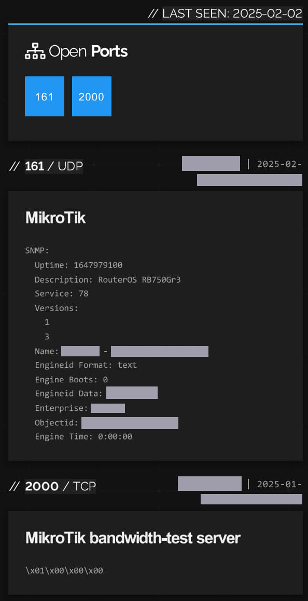

# Estudo de Caso 02: Reavaliação de Segurança e Análise de Ativos de Rede

## 1. Objetivo

Esta análise foi conduzida como um acompanhamento do Estudo de Caso 01, com dois objetivos principais:
1.  Verificar se a vulnerabilidade crítica de exposição de informações na aplicação web havia sido remediada.
2.  Realizar uma nova varredura de OSINT para identificar quaisquer novos ou remanescentes pontos de exposição na infraestrutura externa da organização.

## 2. Metodologia

A abordagem foi dividida em duas frentes de investigação paralelas.

### Fase 1: Re-teste da Aplicação Web
O foco foi recriar a exploração da falha de roteamento `HTTP/HTTPS` identificada anteriormente. A replicação manual inicial se mostrou inconsistente, indicando uma possível correção parcial ou uma falha intermitente. Para garantir um resultado definitivo, utilizei o **Burp Suite** para automatizar e manipular um volume maior de requisições malformadas, conseguindo, por fim, forçar a aplicação ao mesmo estado de `crash` e exposição de dados.

### Fase 2: OSINT e Descoberta de Ativos de Rede
Uma nova investigação de OSINT foi iniciada do zero. Utilizando a análise da árvore BGP, geolocalização e varredura de ranges de IP, foi possível identificar a nova pegada de rede da empresa e descobrir múltiplos dispositivos de rede expostos publicamente.

## 3. Descobertas (Findings)

### Finding 2.1: (CRÍTICO) Persistência de Vulnerabilidade na Aplicação Web
* **Descrição:** A reavaliação confirmou que a falha crítica de tratamento de erro na rota `HTTP/HTTPS`, detalhada no Estudo de Caso 01, **não foi corrigida**. A aplicação continuava vulnerável à mesma técnica de manipulação de requisições, expondo versões de software, paths de diretórios e código-fonte.
* **Impacto:** O risco de Execução Remota de Código (RCE) e comprometimento do servidor permanecia ativo, indicando uma falha no processo de remediação da empresa.
* **Evidência:**
    

### Finding 2.2: (ALTO) Múltiplos Dispositivos de Rede Expostos e Mal Configurados
* **Descrição:** A varredura da infraestrutura revelou pelo menos dois dispositivos de rede críticos expostos e com serviços vulneráveis.
* **Dispositivo 1: Roteador Tenda Wireless (GoAhead-webs)**
    * Um roteador Tenda foi encontrado com sua interface de gerenciamento web exposta na porta não-padrão 1984/tcp, uma tática de "segurança por obscuridade". A exposição deste painel administrativo na internet permite que um atacante tente ataques de força bruta (brute-force) ou explore vulnerabilidades conhecidas no servidor GoAhead-webs para obter controle total do dispositivo.
* **Dispositivo 2: Roteador MikroTik (RouterOS RB750Gr3)**
    * O roteador foi identificado com o hostname `empresa - setor`, confirmando sua associação.
    * Duas portas de alto risco estavam abertas para a internet:
        * **161/udp (SNMP):** Se configurado com community strings padrão (ex: "public"), este serviço pode ser usado por um atacante para mapear toda a topologia da rede interna, extrair configurações detalhadas e identificar alvos para ataques posteriores.
        * **2000/tcp (MikroTik Bandwidth-Test):** Este serviço é notoriamente abusado para ataques de negação de serviço (DoS) por amplificação, permitindo que atacantes usem o roteador da empresa para atacar outros alvos na internet.
* **Impacto:** A exposição desses dispositivos criava múltiplos pontos de entrada para a rede interna e expunha a empresa a riscos de vazamento de informações, negação de serviço e potencial comprometimento da infraestrutura.
* **Evidência:**

    

## 4. Conclusão da Análise 2

A reavaliação demonstrou falhas sistêmicas na postura de segurança da organização. Além da falha em remediar uma vulnerabilidade crítica já reportada na aplicação web, a falta de uma gestão de ativos de rede eficaz resultou na exposição de múltiplos dispositivos de infraestrutura. Isso indica a necessidade de um programa de segurança mais robusto, incluindo um processo formal de gestão de vulnerabilidades (patch management) e auditorias regulares do perímetro de rede.
